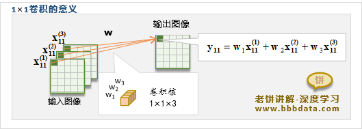
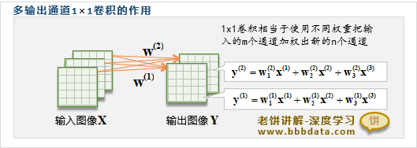
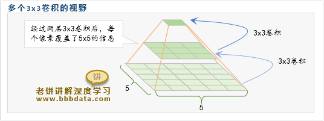

## 线形神经网络

### 自回归

用归过去预测为未来
今天的天气=f(昨天的天气，前天的天气。。。)

### 隐变量自回归
隐变量自回归就是在普通自回归的基础上，加入了一些"看不见但很重要"的因素。
明天客流 = f(昨天客流, 前天客流, ... + 隐藏的天气影响, 隐藏的心理因素, ...)

## 多层感知机

### 权重衰减（L2正则化）
使用L2范数的一个原因是它对权重向量的大分量施加了巨大的惩罚
`Loss=L(w,b)+w^2`

### dropout
在训练过程中，在计算后续层之前向网络的每一层注入噪声。 因为当训练一个有多层的深层网络时，注入噪声只会在输入-输出映射上增强平滑性。

这个想法被称为暂退法（dropout）。 暂退法在前向传播过程中，计算每一内部层的同时注入噪声，这已经成为训练神经网络的常用技术。 这种方法之所以被称为暂退法，因为我们从表面上看是在训练过程中丢弃（drop out）一些神经元。 在整个训练过程的每一次迭代中，标准暂退法包括在计算下一层之前将当前层中的一些节点置零。

## 深度学习计算

### 自定义块

1.将输入数据作为其前向传播函数的参数。
2.通过前向传播函数来生成输出。请注意，输出的形状可能与输入的形状不同。例如，我们上面模型中的第一个全连接的层接收一个20维的输入，但是返回一个维度为256的输出。
3.计算其输出关于输入的梯度，可通过其反向传播函数进行访问。通常这是自动发生的。
4.存储和访问前向传播计算所需的参数。
5.根据需要初始化模型参数。

## CNN 卷积神经网络

*卷积神经网络*（convolutional neural network，CNN）是一类强大的、为处理图像数据而设计的神经网络。 基于卷积神经网络架构的模型在计算机视觉领域中已经占主导地位，当今几乎所有的图像识别、目标检测或语义分割相关的学术竞赛和商业应用都以这种方法为基础

### MLP的局限性

1.参数爆炸：28x28 图像展平成 784 输入；若第一层有 1000 隐藏单元，就要 784×1000≈78万参数；更大图像（如 224x224x3=150528）直接失控。

2.忽略空间结构：全连接把像素当前互不相关的独立特征，丢失了图片的空间信息。

3.对平移不鲁棒：同一物体评议，激活模式完全改变。

### CNN是怎么做的

#### 权重共享

在卷积神经网络中，同一个卷积核（滤波器）的参数在输入特征图的不同空间位置上重复使用。也就是说：一组权重 W 不是只服务于某一块区域，而是对整幅图像滑动应用。这种“同一组参数，多处复用”就是权重共享。

**优点**

1. 大幅减少参数量 → 降低过拟合风险
2. 注入“模式可在任意位置出现”的先验 → 获得平移等变性

若用全连接层映射到 100 个隐藏单元：参数 = 32×32×3×100 ≈ 307 万
若用 6 个 5×5 卷积核（stride=1, 不含池化）：参数 = 5×5×3×6 + 6 ≈ 456

#### 局部性

局部性（Locality）指：数据中“相邻”或“近邻”元素之间更相关，远处相关性较弱的规律。

- 图像：猫耳朵特征在 7×7 区域内即可识别，无需看整幅图。
- 语音：音素主要由短时间帧决定。

### 卷积层

卷积层对输入和卷积核权重进行互相关运算，并在添加标量偏置之后产生输出。 所以，卷积层中的两个被训练的参数是卷积核权重和标量偏置。 就像我们之前随机初始化全连接层一样，在训练基于卷积层的模型时，我们也随机初始化卷积核权重。

基于上面定义的`corr2d`函数实现二维卷积层。在`__init__`构造函数中，将`weight`和`bias`声明为两个模型参数。前向传播函数调用`corr2d`函数并添加偏置。

#### 多通道输入（transformer 中的类似多头）

#### 多通道输出

在最流行的神经网络架构中，随着神经网络层数的加深，我们常会增加输出通道的维数，通过减少空间分辨率以获得更大的通道深度。直观地说，我们可以将每个通道看作对不同特征的响应。而现实可能更为复杂一些，因为每个通道不是独立学习的，而是为了共同使用而优化的。因此，多输出通道并不仅是学习多个单通道的检测器。

#### 1*1卷积核

卷积失去了卷积层的特有能力——在高度和宽度维度上，识别相邻元素间相互作用的能力。 其实1*1卷积的唯一计算发生在通道上。

单个1x1卷积核可以理解为以通道为单位，将各个通道的信息加权合并为一个通道

### 

而多个1x1卷积核则是以不同的权重，将输入通道加权合并出成多个输出通道

#### 3*3卷积

在CNN模型中基本就只用3×3卷积，而很少使用其它更大的卷积，大的卷积一般可以使用多个小卷积来替换，
如下，虽然单层3x3卷积只有3x3的视野，但2层3x3卷积叠加后就能获得5x5的视野

### 

### 汇聚层

通常当我们处理图像时，我们希望逐渐降低隐藏表示的空间分辨率、聚集信息，这样随着我们在神经网络中层叠的上升，每个神经元对其敏感的感受野（输入）就越大。

而我们的机器学习任务通常会跟全局图像的问题有关（例如，“图像是否包含一只猫呢？”），所以我们最后一层的神经元应该对整个输入的全局敏感。通过逐渐聚合信息，生成越来越粗糙的映射，最终实现学习全局表示的目标，同时将卷积图层的所有优势保留在中间层。

*汇聚*（pooling）层，它具有双重目的：降低卷积层对位置的敏感性，同时降低对空间降采样表示的敏感性。

#### 最大汇聚层和平均汇聚层

汇聚层运算符由一个固定形状的窗口组成，该窗口根据其步幅大小在输入的所有区域上滑动，为固定形状窗口（有时称为*汇聚窗口*）遍历的每个位置计算一个输出。 然而，不同于卷积层中的输入与卷积核之间的互相关计算，汇聚层不包含参数。 相反，池运算是确定性的，我们通常计算汇聚窗口中所有元素的最大值或平均值。这些操作分别称为*最大汇聚层*（maximum pooling）和*平均汇聚层*（average pooling）。

### LeNet

总体来看，LeNet（LeNet-5）由两个部分组成：

- 卷积编码器：由两个卷积层组成;

- 全连接层密集块：由三个全连接层组成。### 优化算法

  - 对于深度学习问题，通常会先定义**损失函数**，在有了损失函数之后，就可以使用优化算法来尝试最小化损失
  - 在优化中，损失函数通常被称为**优化问题的目标函数**
  - 大多数优化算法都关注的是最小化，如果需要最大化目标，只需要在目标函数前加**负号**就可以了
  
  
  
  
### 优化算法
  **优化和深度学习**

  1、尽管优化提供了一种最大限度减少深度学习损失函数的方法，但本质上优化和深度学习的目标是根本不同的

  - 优化主要关注的是**最小化目标**
  - 深度学习关注的是**在给定有限数据量的情况下寻找合适的模型**

  2、具体的区别例如**训练误差**和**泛化误差**

  - 优化算法的目标函数通常是基于训练数据集的损失函数，因此优化的目标是**减少训练误差**
  - 深度学习的目标是**减少泛化误差**，为了达到减小泛化误差的目的，除了使用**优化算法**来减少训练误差外，还需要注意**过拟合**

  3、经验风险和风险

  - **经验风险**：训练数据集的平均损失
  - **风险**：整个数据群的预期损失
  - 训练数据集的最低经验风险可能和最低风险（泛化误差）不同

  4、优化问题的一般形式：

  

  - 在深度学习中，f(x) 是损失函数（给定一个输入，预测和真实标号之间的差距）；x 是所有的超参数，不管矩阵还是张量 ，最终都会转换成一个向量
  - 限制集合 C 在优化中比较常见，在具体的优化中有很多的假设，但是在深度学习中，尽量使得 C 不受限制，不受限制的话相对来讲优化起来会快一点

  

  

  

  

  **深度学习中的挑战**

  - 在深度学习中，大多数目标函数都很复杂，没有解析解

  

  **局部最小 vs 全局最小**

  1、全局最小

  

  - x* 对应的目标函数的值**不大于**求解区间中所有的 x 对应的目标函数值
  - 如果 f(x) 在 x 处的值是**整个域中目标函数的最小值**，那么 f(x) 是全局最小值

  2、局部最小

  

  - 存在一个 ε ，使得任何 x 和解 x* 的距离小于半径 ε 的时候，在这个范围内的 x 对应的目标函数值都**不小于** f(x*) 
  - 对于任何目标函数 f(x)，如果在 x* 处对应的目标函数的值小于在 x* 附近任意其他点的 f(x) 的值，那么 f(x) 可能是局部最小值

  3、例

  在 x*cos(𝝅*x) 中

  - local minimum 表示局部最小值：在**该点附近的局部区域内**，其他 x 对应的目标函数值都**不小于** f(x*)
  - global minimum 表示全局最小值：在**整个函数中**，定义域内的其他 x 对应的目标函数的值都**不小于** f(x*)

  

  4、求解

  一般使用迭代算法来求解，

  - 机器学习也好，深度学习也好，目标问题都不能求出显式解，所以使用迭代算法
  - 一般来说，迭代算法只能保证找到局部最小值

  局部最小值处的梯度是零

  - 因为使用的是梯度下降，到了局部最小的地方，梯度就变成零了，此时不管学习率取多大都不会再动了，所以说只能保证找到局部最小值

  5、深度学习模型的目标函数通常有许多局部最优解

  - 当优化问题的数值解接近局部最优值时，随着目标函数解的梯度接近或变为零，通过最终迭代获得的数值解可能仅使目标函数局部最优，而不是全局最优
  - 只有**一定程度的噪声**可能会使参数跳出局部最小值（小批量随机梯度下降的有利特性之一，小批量上梯度的自然变化能够将参数从局部极小值中跳出）

  

  

  **鞍点（saddle point）**

  - 除局部最小值之外，鞍点是梯度消失的另外一个原因

  

  1、定义：鞍点指的是**函数的所有梯度都消失但既不是全局最小值也不是局部最小值的任何位置**

  

  2、假设函数的输入是 k 维向量，它的输出是标量，因此其 **Hessian 矩阵（也称黑塞矩阵）**将有 k 个特征值

  函数的解可能是局部最小值、局部最大值或函数梯度为零位置处的鞍点：

  - 当函数在零梯度位置处的 Hessian 矩阵的特征值**全部为正值**时，该函数存在**局部最小值**
  - 当函数在零梯度位置处的 Hessian 矩阵的特征值**全部为负值**时，该函数存在**局部最大值**
  - 当函数在零梯度位置处的 Hessian 矩阵的特征值为**正值和负值**时，该函数存在**鞍点**（对于高维度问题，至少部分特征值为负的可能性相当高，因此鞍点比局部最小值更有可能出现）

  3、凸函数是 Hessian 函数的特征值永远不为负值的函数

  - 大多数深度学习问题并不属于这一类，但是它仍是研究优化算法的一个很好的工具

  

  

  **梯度消失**

  1、在某一个时刻开始，函数 f(x) 的梯度接近零，这会导致优化会停止很长一段时间

  - 比如 f(x) = tanh(x) 从 x = 4 开始，f(x) 的梯度接近 0 

  

  2、引入 **ReLU 激活函数**能够很好地缓解这个问题

  3、对于深度学习，其实没有必要找到最优解，**局部最优解或者其近似解**仍然非常有用

  

  

  **小结**

  1、最小化训练误差并不能保证能够找到最佳的参数集来最小化泛化误差

  2、优化问题可能有许多局部最小值

  3、实际问题中可能会出现**多个鞍点**，因为问题通常不是凸的

  4、梯度消失可能会导致优化停滞，**重参数化**通常会有所帮助，**对参数进行良好的初始化**也可能是有益的

  

  

  

  

  **凸性（convexity）**

  1、凸性在优化算法的设计中起到至关重要的作用，主要是由于在这种情况下对算法进行分析和测试要容易

  - 如果算法在凸性条件设定下的效果很差，则通常很难在其他条件下看到好的结果

  2、即使深度学习中的优化问题通常是非凸的，它们经常也在局部极小值附近表现出一些凸性

  

  **凸集**

  - 凸集是凸性的基础

  1、如果对于任何 a , b ∈ X ，连接 a 和 b 的线段也位于 X 中，则向量空间中的一个集合 X 是*凸*（convex）的

  - 在一个区域中找任意两个点连成一条线，这条线上所有的点都在这个区域当中

  

  - 上图中左边一列表示的是凸集，右边一列不是凸集

  2、假设 X 和 Y 是凸集，那么 X ∩ Y 也是凸集

  

  - 相反，凸集的并集并不一定是凸的，也可能是非凸 (nonconvex) 的

  

  3、定义：

  - 深度学习中的问题通常是在凸集上定义的

  

  

  

  **凸函数（convex function）**

  - 对于某函数上的任意两点所连成的线，这两点之间所有的 x 对应的函数 y 的曲线都在这条线的下方

  

  

  1、定义：

  

  

  

  - 除去两点连线的两个端点，函数的曲线都在连线的下方（没有交点）

  2、性质

  - 凸函数的局部极小值也是全局极小值（并不意味着不能有多个全局最小值（f(x) = max(|x-1|,0) 在 [-1，1] 区间上都是最小值），或者可能不存在一个全局最小值（f(x) = exp(x) 在 R 上没有最小值，无限趋近于 0 但不等于 0））

  

  

  **凸函数优化**

  - 如果代价函数 f 是凸的，且限制集合 C 是凸的，那么就是凸优化问题，那么局部最小一定是全局最小（也就是说优化算法找到的局部最小点一定是全局最优解）
  - 严格凸优化问题有唯一的全局最小

  

  - 上图左侧的函数不是严格的凸函数，不满足严格凸函数的定义，函数上存在两点的连线（除端点外）与函数存在交点
  - 上图右侧的函数是一个严格的凸函数，所以它只有唯一的最小值

  

  

  **凸和非凸例子**

  1、机器学习绝大部分都不是凸优化

  2、目前为止只有两个是凸的：

  - 线性回归：

  

  - softmax 回归：softmax 也是线性的

  3、剩下的都是非凸的

  - **MLP**：有一个隐藏层的 MLP，因为**激活函数不是线性的**，导致它是非线性的（非线性的是非凸的）
  - **CNN**：卷积本身是线性的，但是卷积加了**激活函数**之后就不是线性的了
  - **RNN**
  - **attetion**
  - ...

  4、所有的模型都是非凸的

  - 凸函数的表达能力是非常有限的
  - 对于深度学习来讲，实用性是排在第一位的，理论是靠后的，如果是研究理论的话，需要从统计的角度来看待问题，从统计的角度来讲会考虑很多的凸优化问题
  - 从深度学习来讲，是从计算机的角度考虑**效果**，而不是过于考虑**理论**，所导致基本上做的都是非凸的
  - 优化的很多理论基本上是凸优化，最近也有研究非凸的，但是整体来讲大块是针对凸函数的优化，对于非凸的模型很难说有特别大的指导意义

  

  

  **小结**

  1、凸集的交点是凸的，并集不是

  2、一个二次可微函数是凸函数，当且仅当其 Hessian (二阶导数据矩阵)是**半正定**的

  

  

  

  

  **梯度下降（gradient descent）**

  - 梯度下降很少**直接**用于深度学习
  - **由于学习率过大，优化问题可能会发散**，这种现象早已在梯度下降中出现

  

  1、梯度下降算法是最简单的迭代求解算法

  

  - 选取开始点 x0
  - 对 t = 1，2，...，T

  

  - η 叫做学习率
  - 上图中蓝色的曲线是目标函数的**等高线**
  - 圆圈中心表示最小值，离圆心越远的地方值越大
  - 梯度下降会从圆圈外一直到圆圈中心值最小的地方

  

  

  2、学习率（learning rate）

  学习率决定目标函数能否收敛到局部最小值，以及何时收敛到最小值，通常用 η 表示

  - 如果使用的学习率太小，将导致 **x 的更新非常缓慢，需要更多的迭代**
  - 如果学习率过高可能会导致 **x 振荡甚至可能逐渐发散**

  

  

  **小结**

  1、学习率的大小很重要：学习率太大会使模型发散，学习率太小会没有进展

  2、梯度下降可能陷入局部极小值，而得不到全局最小值

  3、在高维模型中，调整学习率是比较复杂的

  

  

  

  

  **随机梯度下降（stochastic gradient descent）**

  - 在深度学习中，目标函数通常是**训练数据集中每个样本的损失函数的平均值**

  

  1、通常使用的都是随机梯度下降而不用梯度下降，因为当有 n 个样本的时候，f(x) 表示所有样本上损失的平均值，当样本特别多、计算一个样本比较贵的时候，求 f(x) 的导数是比较贵的

  

  - 梯度下降是在整个完整的样本上求导，比较贵，所以通常使用的都是随机梯度下降

  2、随机梯度下降在时间 t 随机选择一个样本 ti 上的梯度来近似 f(x) 的梯度

  - 这么做是因为求导是线性可加的

  

  

  

  - 因为样本 ti 是随机选择的，所以导数的期望就是所有样本的梯度的均值，而所有样本的梯度的均值和 f(x) 梯度的期望是差不多的，虽然有噪音，但是均值是近似相等的，也就是说大的方向是一致的
  - 这样做的好处是**每次只用算一个样本的梯度**就可以了，而**不用计算全部样本的梯度**（可能会导致重复性的计算）

  3、对比梯度下降（上）和随机梯度下降（下）

  

  - 随机梯度下降整个过程不像梯度下降那么平滑，特别是在最后阶段比较曲折，但是整个大的方向和梯度下降是一致的（均值没有发生变化）
  - 因为每一次计算只需要计算一个样本的梯度，所以虽然可能会走一点弯路，但是整体来看还是比较划算的

  4、随机梯度下降在机器学习中的应用是在 2003 的时候提出来的，之前都是使用的梯度下降

  - 随机梯度下降成为了整个深度学习的基础
  - 其他的机器学习模型不一定会使用随机梯度下降

  

  

  **小结**

  1、对于凸问题，对于广泛的学习率选择，随机梯度下降将收敛到最优解。但是对于深度学习而言，情况通常并非如此。但是对凸问题的分析能够深入了解如何进行优化，即逐步降低学习率，尽管不是太快

  2、如果学习率太小或太大都会出现问题，实际上，通常只有经过多次实验之后才能找到合适的学习率

  3、当训练数据集中有更多样本时，计算梯度下降的每次迭代的代价更高，因此在这些情况下，首选随机梯度下降

  4、随机梯度下降的最优性保证在非凸情况下一般不可用，因为需要检查的局部最小值的数量可能是指数级的

  

  

  

  

  **小批量随机梯度下降（minibatch gradient descent）**

  - **梯度下降使用完整的数据集来计算梯度并更新参数**；**随机梯度下降中一次处理一个训练样本来取得进展**
  - 每当数据非常相似时，梯度下降并不是非常**“数据高效”**
  - 由于 CPU 和 GPU 无法充分利用向量化，随机梯度下降并不是特别**“计算高效”**
  - 使用小批量的决策的核心是**计算效率**

  

  1、在实际应用中，真正使用的是小批量随机梯度下降

  - 之所以用小批量随机梯度下降，不是统计的原因，而是计算的原因，因为随机梯度下降对单样本计算梯度，这样的话**很难完全利用硬件资源**（CPU 和 GPU 都是多线程的，假设只是对单样本进行梯度计算的话，计算量可能不足以能够占满整个硬件资源）
  - 所以假设可以用多个样本计算的话，每个样本的计算是可以并行的，能够提高计算的并行度，所以在实际使用中通常使用的是小批量随机梯度下降

  2、定义：

  

  - **It**：随机采样一个样本的子集
  - **b**：批量大小
  - 在计算梯度的时候，对 It 中采样的 b 个样本都求梯度，然后除以 b 求平均值，以此来近似整个目标函数的梯度

  3、同理，因为是随机采样，最后又除以了随机采样的样本数量，所以它的期望是没变的，是一个无偏的近似，和随机梯度一样，大的方向是一致的，但是它的好处在于这样计算降低了方差（因为是 b 个样本的平均，所以整体在方向上的抖动相对来讲会小一些，噪音会少一点，更加平滑）

  4、下图中，y 轴表示损失，x 轴表示时间（已经做了对数处理）

  

  - **gd**：梯度下降，梯度下降在一开始的时候就能达到很好的效果
  - **sgd**：随机梯度下降，随机梯度下降比梯度下降要慢，因为每次只计算一个样本的梯度，所以无法完全利用硬件资源进行并行计算，所以如果单纯从物理时间来看的话，这样做是不划算的
  - 所以需要在随机梯度下降中加入比较大的批量
  - 一般来说，批量小的时候收敛比较快，但是计算比较慢；批量很大的时候，每次计算的代价比较大，所以批量大小在一个比较合适的数量是比较好的，不能太小也不能太大

  

  

  **小结**

  - 随机梯度下降的“统计效率”与大批量一次处理数据的“计算效率”之间存在权衡，小批量随机梯度下降提供了两全其美的答案：**计算和统计效率**
  - 在小批量随机梯度下降中，处理通过训练数据的随机排列获得的批量数据（每个观测值只处理一次，但按随机顺序）
  - 在训练期间降低学习率有助于训练
  - 一般来说，小批量随机梯度下降比随机梯度下降和梯度下降的速度快，收敛风险较小

  

  

  

  

  **冲量法（momentum）**

  - 对于嘈杂的梯度，在选择学习率需要格外谨慎，**如果衰减速度太快，收敛就会停滞**；相反，**如果太宽松，就肯恶搞无法收敛到最优解**

  

  1、冲量法也是在实际应用中使用比较多的算法

  2、冲量法使用平滑过的梯度对权重更新

  

  - 在小批量随机梯度下降的时候，梯度还是会有比较大的抖动，特别是当整个目标函数比较复杂的时候
  - 真实数据的损失函数是不平滑的，在一个不那么平滑的平面上做优化的时候，梯度的变化趋势就有点类似于随机运动，噪音可能会带来一些不必要的抖动
  - 冲量法中，它维护了一个惯性，使得梯度变化的方向不要变化太快，方向还是要改变的，这是变化起来比较平滑
  - vt 实际上是等于当前时刻的梯度+ β*上一个时刻的梯度 + β*β*上上个时刻的梯度...
  - β 是一个小于 1 的值，所以 vt 中历史时刻的梯度项随着时间的下降存在指数级的减少，时间越早的梯度项，最后的值就越小
  - 通过这样的设计使得对整个权重更新的方向并不是完全取决于 gt ，还要参考过去时间的梯度，如果当前时刻的 gt 和上一时刻的 g(t-1) 完全不同的话，使得 g(t-1) 能够通过 β 对 gt 变化的方向进行一定程度的抵消，使得更新不那么剧烈

  3、β 常见的取值：0.5、0.9、0.95、0.99

  - 假设 β 取 0.5 的话，vt 中历史时刻的梯度项会衰减得特别快（大概是计算过去两三个时刻的梯度取平均）
  - 假设 β 取 0.99 的话，vt 中历史时刻的梯度项会衰减得比较慢，可以认为 gt 的变化会参考过去几十个时刻梯度的方向（大概是计算过去五十个时刻的梯度取平均，超过 50 个以外的那些梯度项就变得很小了，几乎可以忽略不计）
  - 如果说样本数量比较大，β 取 0.99 也很正常

  4、对比随机梯度下降（上）和冲量法（下）

  

  - 随机梯度下降上下振动的幅度比较大
  - 冲量法是**几个相互冲突的方向**在慢慢相互抵消，使得梯度的变化尽量朝着正确的方向

  5、通过框架中的 moment 这个超参数来设定冲量法

  - 最简单的 sgd 都有 moment 的选项，只需要将 moment 设置成自己想要的值就可以了

  

  

  **小结**

  1、冲量法用**过去梯度的平均值**来替换梯度，大大加快了收敛速度

  2、对于无噪声梯度下降和嘈杂随机梯度下降，冲量法都是可取的

  3、冲量法可以防止**在随机梯度下降的优化过程停滞**的问题

  4、由于对过去的数据进行了指数降权，**有效梯度为 1/(1-β)**

  

  

  

  

  **Adam**

  - 随机梯度下降在解决优化问题时比梯度下降更有效
  - 在一个小批量中使用更大的观测值集，可以通过向量化提供额外效率，这也是高效的多机、多 GPU 和整体并行处理的关键

  

  1、Adam 是在实际应用中使用得最多的

  2、之所以用 Adam 并不是因为它比 sgd ，Adam 最大的优点在于它**对学习率不是很敏感**，在里面做了非常多的平滑，可以认为是一个非常平滑的 sgd

  - sgd+moment 实际上效果已经非常好了，实际上可以不用 Adam 也可以，Adam 优化的效果不一定优于 sgd+moment
  - 平滑的好处在于对学习率不敏感，如果说没有太多的时间去调参的话，Adam 是一个不错的选择；如果会调参的话，使用 sgd+moment 或者是别的一些优化算法，可能效果会比 Adam 还要好一点
  - 因为 Adam 比较简单，所以使用的还是比较多的

  3、定义：

  

  - 和冲量法的不同之处在于 β1 是不需要调的，通常取 0.9

  

  - 这里使用的是**调和平均**

  

  - 因为 v0 = 0 ，所以在一开始的时候会偏小，所以当 t 比较小的时候这里做了一个修正（修正偏向 0 的趋势）
  - 对于 t 比较大的时候，由于 β1 是一个小于 1 的数，1 - β1^t 会趋近于零，因此不会对 vt 产生影响，因此这里所做的修正主要是针对 t 比较小的时候

  

  - st 和 vt 有点类似，唯一的区别是 st 中的 gt 多了一个平方（gt 是一个向量，gt 的平方计算是对 gt 中的每个元素进行平方），也就是说这里对向量 gt 中的每个元素的平方做了平滑处理
  - 0.999 是一个比较大的窗口的平滑

  

  - vt hat 可以认为是整个梯度的平滑版本，过去的所有时间的梯度的加权和‘
  - 这里的除法也是按照元素进行计算
  - 有时候每一个维度的值可能是不一样的，有些值可能比较大，有些值可能比较小（NLP 中出现的比较多，有些词出现的比较频繁，有些词出现的比较少，所以那些频繁出现的词的梯度就会比较大，而出现比较少的词的梯度就会比较小），在做特征提取的时候，如果没有做好**归一化**，有些特征的值会比较大，有些特征的值会比较小就会出现特征值比较大的梯度就比较大，特征值比较小的梯度就会比较小，所以就会导致在取学习率的时候会比较麻烦：如果学习率取得比较大的话，在乘上比较大的梯度的时候，就会导致更新比较大，从而导致梯度爆炸：如果想要将学习率取得比较小来避免梯度爆炸，但是对于那些值比较小的梯度乘上学习率之后更新的不够，就会导致收敛比较慢
  - 所以这里对于梯度的调整就有点类似于对梯度做归一化，将值比较大或者比较小的梯度拉到一个合适的范围之中（进行维度上的调整）
  - 分母中的 ε 的作用是保证分母不等于零

  

  - 因为在 Adam 中做了很多的平滑，所以最终得出的 gt 的值都是比较均匀的

  

  

  

  

  **总结**

  1、深度学习模型大多是非凸的

  - 所以关于凸优化的很多理论无法使用

  2、小批量随机梯度下降是最常用的优化算法

  3、冲量对梯度做平滑

  - 冲量法是一个简单的稳定优化的算法

  4、Adam 对梯度做平滑，且对梯度各个维度值做重新调整

  - 通过实践发现，Adam 不一定比冲量法准确率高或者是收敛快，但是整体来讲 Adam 是比较稳定的，Adam 对学习率不那么敏感，使得调参相对来讲会更加容易一点
  - 对于新的模型，如果没有很好的调参，可以直接使用 Adam

  
