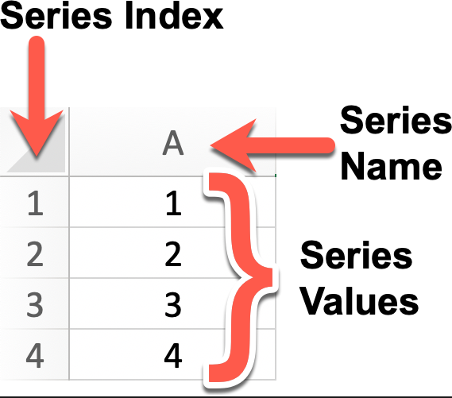
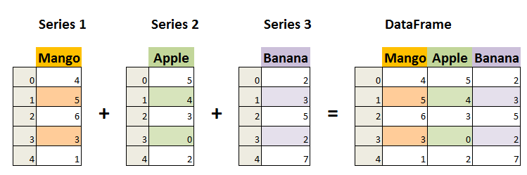

## 简介
Pandas 是一个开源的数据分析和数据处理库，它是基于 Python 编程语言的。
Pandas 提供了易于使用的数据结构和数据分析工具，特别适用于处理结构化数据，如表格型数据（类似于Excel表格）。
Pandas 是数据科学和分析领域中常用的工具之一，它使得用户能够轻松地从各种数据源中导入数据，并对数据进行高效的操作和分析。
Pandas 主要引入了两种新的数据结构：Series 和 DataFrame。
- Series： 类似于一维数组或列表，是由一组数据以及与之相关的数据标签（索引）构成。Series 可以看作是 DataFrame 中的一列，也可以是单独存在的一维数据结构。
[alt text](/pandas_learn/assets/628084-20201205212241597-1156923446.png)
- DataFrame： 类似于一个二维表格，它是 Pandas 中最重要的数据结构。DataFrame 可以看作是由多个 Series 按列排列构成的表格，它既有行索引也有列索引，因此可以方便地进行行列选择、过滤、合并等操作。

DataFrame 可视为由多个 Series 组成的数据结构：

DataFrame 由 Index、Key、Value 组成：

## 特点
Pandas 特点
高效的数据结构：
- Series：一维数据结构，类似于列表（List），但拥有更强的功能，支持索引。
- DataFrame：二维数据结构，类似于表格或数据库中的数据表，行和列都具有标签（索引）。
数据清洗与预处理：
- Pandas 提供了丰富的函数来处理缺失值、重复数据、数据类型转换、字符串操作等，帮助用户轻松清理和转换数据。
数据操作与分析：
- 支持高效的数据选择、筛选、切片，按条件提取数据、合并、连接多个数据集、数据分组、汇总统计等操作。
- 可以进行复杂的数据变换，如数据透视表、交叉表、时间序列分析等。
数据读取与导出：
- 支持从各种格式的数据源读取数据，如 CSV、Excel、JSON、SQL 数据库等。
- 也可以将处理后的数据导出为不同格式，如 CSV、Excel 等。
数据可视化：
- 通过与 Matplotlib 和其他可视化工具的集成，Pandas 可以快速生成折线图、柱状图、散点图等常见图表。
时间序列分析：
- 支持强大的时间序列处理功能，包括日期的解析、重采样、时区转换等。
性能与优化：
- Pandas 优化了大规模数据处理，提供高效的向量化操作，避免了使用 Python 循环处理数据的低效。
- 还支持一些内存优化技术，比如使用 category 类型处理重复的数据。
## Series
Series 是 Pandas 中的一个核心数据结构，类似于一个一维的数组，具有数据和索引。
Series 可以存储任何数据类型（整数、浮点数、字符串等），并通过标签（索引）来访问元素。
Series 的数据结构是非常有用的，因为它可以处理各种数据类型，同时保持了高效的数据操作能力，比如可以通过标签来快速访问和操作数据。

*Series* 特点：
- 一维数组：Series 中的每个元素都有一个对应的索引值。
- 索引： 每个数据元素都可以通过标签（索引）来访问，默认情况下索引是从 0 开始的整数，但你也可以自定义索引。
- 数据类型： Series 可以容纳不同数据类型的元素，包括整数、浮点数、字符串、Python 对象等。
- 大小不变性：Series 的大小在创建后是不变的，但可以通过某些操作（如 append 或 delete）来改变。
- 操作：Series 支持各种操作，如数学运算、统计分析、字符串处理等。
- 缺失数据：Series 可以包含缺失数据，Pandas 使用NaN（Not a Number）来表示缺失或无值。
- 自动对齐：当对多个 Series 进行运算时，Pandas 会自动根据索引对齐数据，这使得数据处理更加高效。

可以使用 pd.Series() 构造函数创建一个 Series 对象，传递一个数据数组（可以是列表、NumPy 数组等）和一个可选的索引数组。
pandas.Series(data=None, index=None, dtype=None, name=None, copy=False, fastpath=False)
参数说明：
- data：Series 的数据部分，可以是列表、数组、字典、标量值等。如果不提供此参数，则创建一个空的 Series。
- index：Series 的索引部分，用于对数据进行标记。可以是列表、数组、索引对象等。如果不提供此参数，则创建一个默认的整数索引。
- dtype：指定 Series 的数据类型。可以是 NumPy 的数据类型，例如 np.int64、np.float64 等。如果不提供此参数，则根据数据自动推断数据类型。
- name：Series 的名称，用于标识 Series 对象。如果提供了此参数，则创建的 Series 对象将具有指定的名称。
- copy：是否复制数据。默认为 False，表示不复制数据。如果设置为 True，则复制输入的数据。
- fastpath：是否启用快速路径。默认为 False。启用快速路径可能会在某些情况下提高性能。

## DataFrame

DataFrame 是 Pandas 中的另一个核心数据结构，类似于一个二维的表格或数据库中的数据表。
DataFrame 是一个表格型的数据结构，它含有一组有序的列，每列可以是不同的值类型（数值、字符串、布尔型值）。
DataFrame 既有行索引也有列索引，它可以被看做由 Series 组成的字典（共同用一个索引）。
DataFrame 提供了各种功能来进行数据访问、筛选、分割、合并、重塑、聚合以及转换等操作。
DataFrame 是一个非常灵活且强大的数据结构，广泛用于数据分析、清洗、转换、可视化等任务。

DataFrame 特点：
- 二维结构： DataFrame 是一个二维表格，可以被看作是一个 Excel 电子表格或 SQL 表，具有行和列。可以将其视为多个 Series 对象组成的字典。
- 列的数据类型： 不同的列可以包含不同的数据类型，例如整数、浮点数、字符串或 Python 对象等。
- 索引：DataFrame 可以拥有行索引和列索引，类似于 Excel 中的行号和列标。
- 大小可变：可以添加和删除列，类似于 Python 中的字典。
- 自动对齐：在进行算术运算或数据对齐操作时，DataFrame 会自动对齐索引。
- 处理缺失数据：DataFrame 可以包含缺失数据，Pandas 使用 NaN（Not a Number）来表示。
- 数据操作：支持数据切片、索引、子集分割等操作。
- 时间序列支持：DataFrame 对时间序列数据有特别的支持，可以轻松地进行时间数据的切片、索引和操作。
- 丰富的数据访问功能：通过 .loc、.iloc 和 .query() 方法，可以灵活地访问和筛选数据。
- 灵活的数据处理功能：包括数据合并、重塑、透视、分组和聚合等。
- 数据可视化：虽然 DataFrame 本身不是可视化工具，但它可以与 Matplotlib 或 Seaborn 等可视化库结合使用，进行数据可视化。
- 高效的数据输入输出：可以方便地读取和写入数据，支持多种格式，如 CSV、Excel、SQL 数据库和 HDF5 格式。
- 描述性统计：提供了一系列方法来计算描述性统计数据，如 .describe()、.mean()、.sum() 等。
- 灵活的数据对齐和集成：可以轻松地与其他 DataFrame 或 Series 对象进行合并、连接或更新操作。
- 转换功能：可以对数据集中的值进行转换，例如使用 .apply() 方法应用自定义函数。
- 滚动窗口和时间序列分析：支持对数据集进行滚动窗口统计和时间序列分析。

DataFrame 构造方法如下：
pandas.DataFrame(data=None, index=None, columns=None, dtype=None, copy=False)
参数说明：
- data：DataFrame 的数据部分，可以是字典、二维数组、Series、DataFrame 或其他可转换为 DataFrame 的对象。如果不提供此参数，则创建一个空的 DataFrame。
- index：DataFrame 的行索引，用于标识每行数据。可以是列表、数组、索引对象等。如果不提供此参数，则创建一个默认的整数索引。
- columns：DataFrame 的列索引，用于标识每列数据。可以是列表、数组、索引对象等。如果不提供此参数，则创建一个默认的整数索引。
- dtype：指定 DataFrame 的数据类型。可以是 NumPy 的数据类型，例如 np.int64、np.float64 等。如果不提供此参数，则根据数据自动推断数据类型。
- copy：是否复制数据。默认为 False，表示不复制数据。如果设置为 True，则复制输入的数据。

## Pandas CSV
- pd.read_csv()	从 CSV 文件读取数据并加载为 DataFrame	filepath_or_buffer (路径或文件对象)，sep (分隔符)，header (行标题)，names (自定义列名)，dtype (数据类型)，index_col (索引列)
- DataFrame.to_csv()	将 DataFrame 写入到 CSV 文件	path_or_buffer (目标路径或文件对象)，sep (分隔符)，index (是否写入索引)，columns (指定列)，header (是否写入列名)，mode (写入模式)

## Pandas json
Pandas 提供了强大的方法来处理 JSON 格式的数据，支持从 JSON 文件或字符串中读取数据并将其转换为 DataFrame，以及将 DataFrame 转换回 JSON 格式。
- 从 JSON 文件/字符串读取数据	pd.read_json()	从 JSON 数据中读取并加载为 DataFrame
- 将 DataFrame 转换为 JSON	DataFrame.to_json()	将 DataFrame 转换为 JSON 格式的数据，可以指定结构化方式
- 支持 JSON 结构化方式	orient 参数	支持多种结构化方式，如 split、records、columns

data = json.loads(f.read()) 使用 Python JSON 模块载入数据。
json_normalize() 使用了参数 record_path 并设置为 ['students'] 用于展开内嵌的 JSON 数据 students。
显示结果还没有包含 school_name 和 class 元素，如果需要展示出来可以使用 meta 参数来显示这些元数据

## Pandas数据清洗
- 数据清洗是对一些没有用的数据进行处理的过程。
- 很多数据集存在数据缺失、数据格式错误、错误数据或重复数据的情况，如果要使数据分析更加准确，就需要对这些没有用的数据进行处理。
- 数据清洗与预处理的常见步骤：
- 缺失值处理：识别并填补缺失值，或删除含缺失值的行/列。
- 重复数据处理：检查并删除重复数据，确保每条数据唯一。
- 异常值处理：识别并处理异常值，如极端值、错误值。
- 数据格式转换：转换数据类型或进行单位转换，如日期格式转换。
- 标准化与归一化：对数值型数据进行标准化（如 Z-score）或归一化（如 Min-Max）。
- 类别数据编码：将类别变量转换为数值形式，常见方法包括 One-Hot 编码和标签编码。
- 文本处理：对文本数据进行清洗，如去除停用词、词干化、分词等。
- 数据抽样：从数据集中抽取样本，或通过过采样/欠采样处理类别不平衡。
- 特征工程：创建新特征、删除不相关特征、选择重要特征等。

## pandas 常用函数

### 读取数据
- pd.read_csv(filename) 读取csv文件
- pd.read_excel(filename) 读取Excel文件
- pd.read_sql(filename) 从SQL数据库读取数据
- pd.read_json(json_string) 从json字符串中读取数据
- pd.read_html(url) 从html页面读取数据

### 查看数据
- df.head(n)	显示前 n 行数据；
- df.tail(n)	显示后 n 行数据；
- df.info()	显示数据的信息，包括列名、数据类型、缺失值等；
- df.describe()	显示数据的基本统计信息，包括均值、方差、最大值、最小值等；
- df.shape	显示数据的行数和列数。

### 数据的选择和切片
- df[column_name] 选择指定的列
- df.loc[row_index,column_name]
- df.iloc[cow_index,column_index]
- df.ix[row_index,column_name]
- df.filter[column_name1,column_name2]
- df.filter(regex='regex') 根据正则表达式选择列
- df.sample(n=5). 随机选择n行

### 数据排序
- df.sort_values(column_name)	按照指定列的值排序；
- df.sort_values([column_name1, column_name2], ascending=[True, False])	按照多个列的值排序；
- df.sort_index()	按照索引排序。

### 数据分组和聚合
- df.groupby(column_name)	按照指定列进行分组；
- df.aggregate(function_name)	对分组后的数据进行聚合操作；
- df.pivot_table(values, index, columns, aggfunc)	生成透视表。

### 数据合并
- pd.concat([df1, df2])	将多个数据框按照行或列进行合并；
- pd.merge(df1, df2, on=column_name)	按照指定列将两个数据框进行合并。

### 数据的选择和过滤
- df.loc[row_indexer, column_indexer]	按标签选择行和列。 可以通过标签和索引选择
- df.iloc[row_indexer, column_indexer]	按位置选择行和列。 只能通过位置选择
- df[df['column_name'] > value]	选择列中满足条件的行。
- df.query('column_name > value')	使用字符串表达式选择列中满足条件的行。

### 数据的统计和描述

- df.describe()	计算基本统计信息，如均值、标准差、最小值、最大值等。
- df.mean()	计算每列的平均值。
- df.median()	计算每列的中位数。
- df.mode()	计算每列的众数。
- df.count()	计算每列非缺失值的数量。